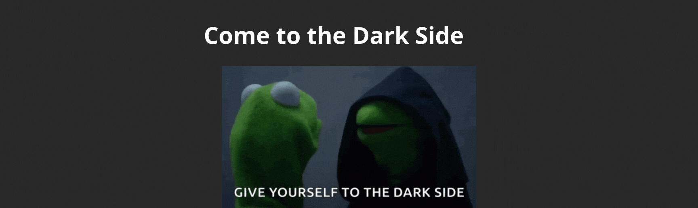

# darkButtonJS
 Modelo de Darkmode con Javascript

<>

<h1>Botón de Modo Oscuro con Javascript</h1>

Este repositorio es para poder tener un modelo de botón de modo oscuro para facilitar la accesibilidad, a personas que como yo, tenemos baja vision.
 
Una cosa importante, es ir realizando iteraciones y pruebas de contraste, para evitar que al intentar usar los altos contraste, se seleccione nuevos colores que no cumplan con el ratio mayor 4.5.

